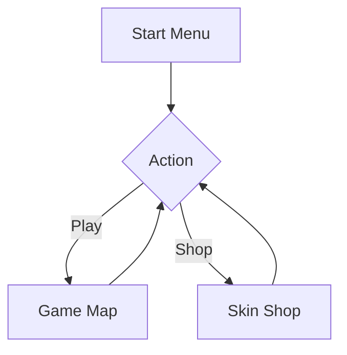

# Monkey Game Software Architecture

## Overview
A browser-based game featuring a monkey, skin shop, and map-based gameplay. Built with Phaser 3 for game physics, rendering, and state management.

## Technology Stack
- **Engine**: [Phaser 3](https://phaser.io/) (for robust game loop, arcade physics, and asset management).
- **Language**: JavaScript (ES6+).
- **Styling**: CSS3 (for UI/Menu layout).

## File Structure
```text
/
├── assets/          # Sprites, audio, maps
├── src/
│   ├── scenes/      # Phaser scenes (StartMenu, SkinShop, GameMap)
│   ├── systems/     # Data handling (State Manager, Storage)
│   ├── entities/    # Player, Snake, Vines
│   ├── config.js    # Game initialization and constraints
│   └── main.js      # Entry point
├── index.html       # Root container
└── style.css        # UI styling
```

## State Management
We will implement a central `StateManager` class that acts as a singleton.
- **Persistence**: Uses `localStorage` to save bananas and owned skins.
- **Communication**: Uses a simple event-emitter pattern (or Phaser's internal event system) to notify scenes when state changes (e.g., banana count update, skin selection).

## Game Loop & Physics
- **Loop**: Utilize Phaser's built-in `update` function within each Scene.
- **Physics**: Use Phaser Arcade Physics for efficient collision detection (Monkey vs. Banana, Monkey vs. Snake, Monkey vs. Vines).

## Flow

